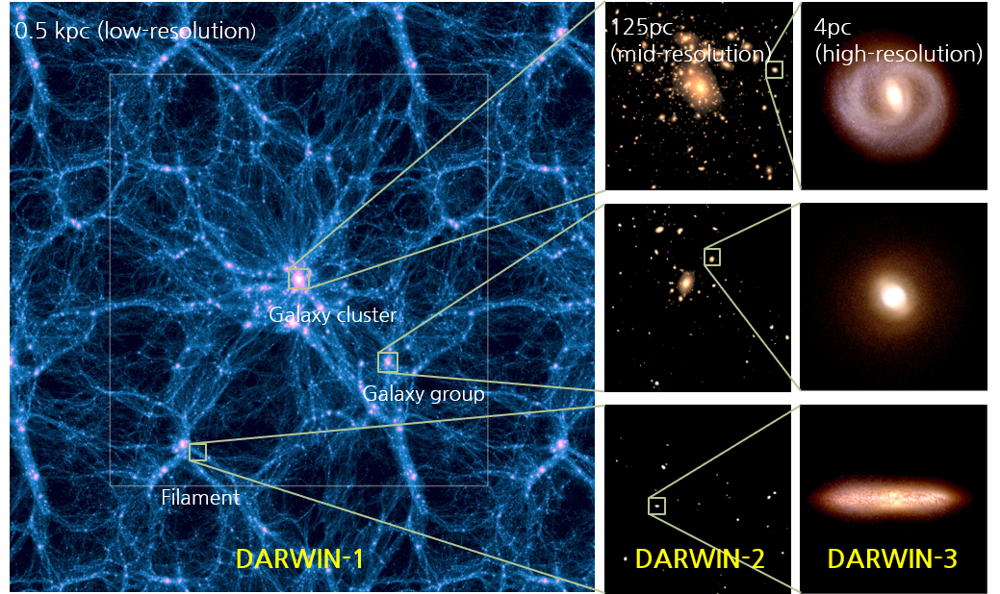
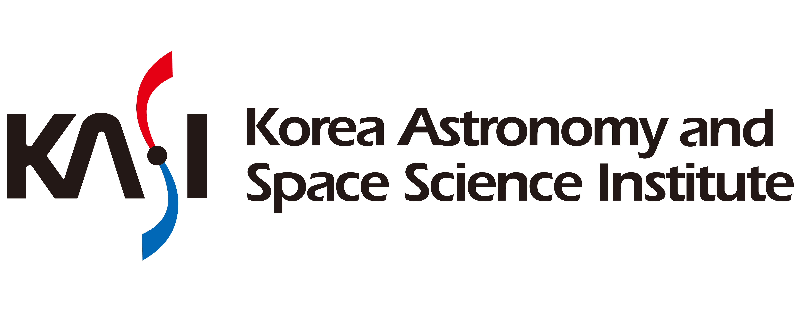

---
#
# Here you can change the text shown in the Home page before the Latest Posts section.
#
# Edit cayman-blog's home layout in _layouts instead if you wanna make some changes
# See: https://jekyllrb.com/docs/themes/#overriding-theme-defaults
#
layout: home
---

The DARWIN (DAzzling Realization of dWarf galaxies In the Next generation of cosmological hydrodynamic simulations) project has been launched under the collaboration of [more than 20 young scientists from seven institutes in Korea](/collaboration.html) since 2022.
The DARWIN project aims at simulating the formation and evolution of dwarf galaxies, a key probe for testing both the galaxy formation models and standard cosmology, with a high resolution based on state-of-the-art physical ingredients in a cosmological context using gigantic computing resources.

The DARWIN project will investigate the evolution and formation of dwarf galaxies using three-step simulations by zooming-in from cosmological scale to several environments with ~100pc resolution, and finally to single dwarf galaxies with <10pc resolution.
To achieve this goal, it will use a heavily modified version of the [RAMSES](https://bitbucket.org/rteyssie/ramses/) hydrodynamic code with the MPI+OMP+GPU parallelism and the next-generation supercomputer at [Korea Insitute of Science and Technology Information](https://www.kisti.re.kr/eng/). 

If you want to download the DARWIN Simulation Data, Use [This](https://archive.kasi.re.kr/darwin/coconas/Darwin)

# Affiliations

